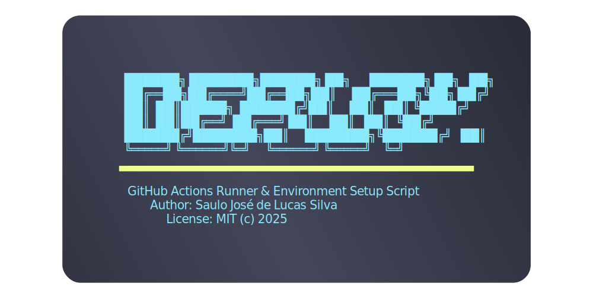

**Making sure your docker runner-actions instance doesn't let you down.**

Automatically deploy your docker runner-actions instance with fast and customizable configurations,
and make sure it's always up and running.

## Features

- Actions-Runner quick setup
- Integrate your runner with your OS init system
- Quickly setup services/timers for your application
- Setup your firewall rules agnostically

## Usage

Fork this repository as submodule inside your project, and run the `deploy.sh` script.

```bash
git submodule add git@github.com:ApplBoy/deploy-ru-be.git deploy
cd deploy
./deploy.sh

# If you already have the submodule in your project
# but there's nothing inside the deploy folder
# you need to initialize the submodule first

# To initialize the submodule, on the root of your project
git submodule update --init --recursive

# To update the submodule, on the root of your project
git submodule update --recursive --remote --merge
```

The default configuration is for SystemD, setting up the runner to restart on reboot, and firewall rules for a web application.

## Configuration

The default setup and files are as follows:

```
.
├── deploy.sh
├── LICENSE
├── ports.txt
├── README.md
├── requirements.txt
├── services
│   └── systemd
│       ├── actions-runner
│       │   └── actions-runner.service
│       ├── install.sh
│       └── remove.sh
├── sys-init.env
└── utils.sh

4 directories, 10 files
```

Inside `services` stays the services/timers for your application, you can add more, edit or remove them as you see fit.
They will be parsed for environment variables, and the `install.sh` script will be run to install them.

When adding a custom init, make sure to add the necessary variables in `sys-init.env` and to create a new `install.sh` script following your
init system's conventions.

As for your firewall, if one or more firewall executables are found in your system, the script will ask you to select one to use, and will
set up the rules in `ports.txt` for you.

**In other words:**

- Services will parse environment variables, located at `services/your-init/your-service.service`
- Declare the instructions to install in a custom init system in `services/your-init/install.sh` and `sys-init.env`
- Firewall rules are located at `ports.txt`, and will be detected by the script

## Roadmap

- [ ] Add support for more init systems
- [ ] Add support for database setup and cloning
- [ ] Add support for Nginx setup for docker proxying

## Contributing

Feel free to open an issue or a pull request, and I'll be happy to help you out.

## License

This project is licensed under the MIT License - see the [LICENSE](LICENSE) file for details.
